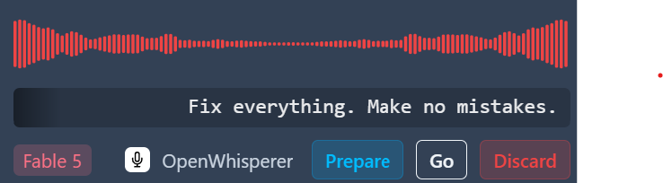
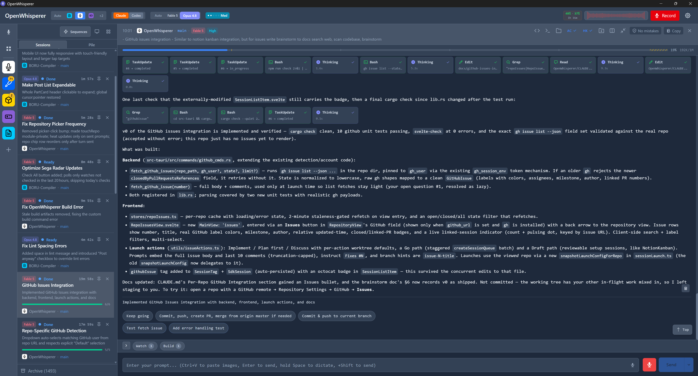
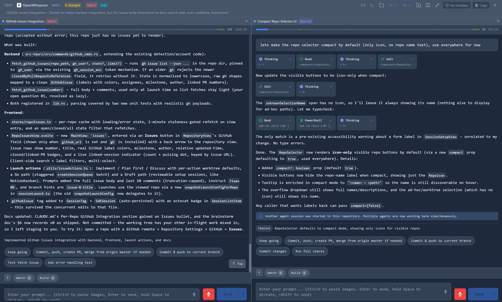
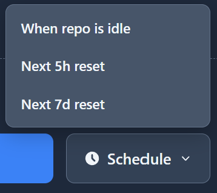
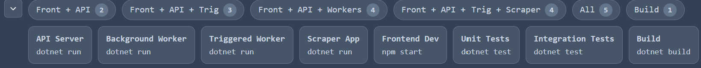
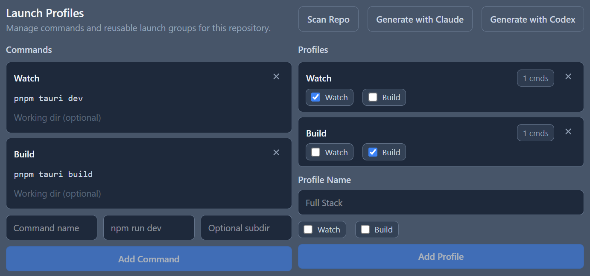
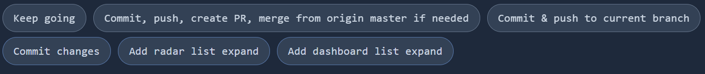
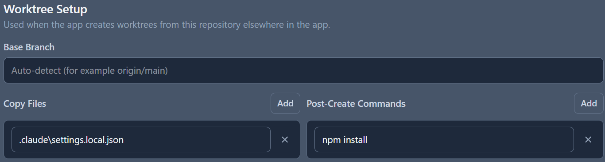
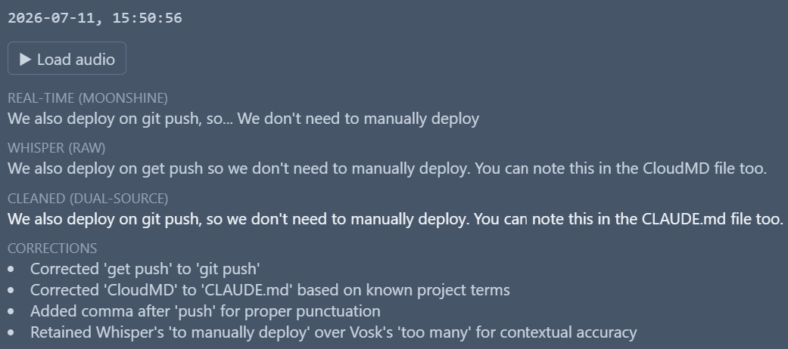
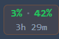

# OpenWhisperer



**One cockpit for your coding agents.** OpenWhisperer is a desktop app that runs Claude Code and Codex sessions side by side — parallel sessions across repos and worktrees, smart queueing around usage limits, one-click launch profiles, and per-session models and effort. Work by typing, by voice, or any mix of the two — the voice layer is entirely optional.

[](https://github.com/iSirux/OpenWhisperer/releases/latest)
[](LICENSE)
[](https://v2.tauri.app/)



## Why

Terminal agents scale badly: more parallel work means more terminals, more `/clear`, more babysitting. OpenWhisperer puts every session in one window — split panes, per-session provider/model/effort, worktree automation with launch profiles, and a Smart Queue that parks work when you hit a rate limit and resumes it when your usage window resets.

And when typing is the slow part, speak instead: a global hotkey records from anywhere (even inside a fullscreen app), transcription runs locally, an LLM cleans up the prompt and routes it to the right repository, and a fresh agent session picks it up. Ideas you can't act on yet go to a pile for later. Prefer to never touch a microphone? Everything works without one.

## Table of Contents

- [Features](#features)
- [Screenshots](#screenshots)
- [Getting Started](#getting-started)
- [Hotkeys](#hotkeys)
- [Voice Commands](#voice-commands)
- [Configuration](#configuration)
- [Architecture](#architecture)
- [Contributing](#contributing)
- [License](#license)

## Features

**Agent sessions**

- **Two providers** — Claude (Claude Agent SDK) and OpenAI Codex (app-server), with per-session model and effort selection, live model switching, and an Auto model picker
- **Rich session view** — streaming responses, tool-call grids, subagent tracking, plan approval dialogs, token/cost usage bars, session forking and prompt re-runs
- **Split panes** — up to four sessions side by side
- **Multimodal prompts** — paste or drop images; they're compressed and attached automatically
- **Session persistence** — sessions survive restarts with full conversation history; an archive keeps searchable records of finished work

**Flow management**

- **Recording pile** — an inbox for thoughts captured now and launched later; items get LLM-cleaned transcripts, titles, and repo/model recommendations in the background, and can be batch-launched
- **Smart Queue** — when a provider's usage window is exhausted, new sessions and rate-limited turns queue automatically and dispatch when the window resets
- **Multi-repo aware** — a repository rail with per-repo settings (vocabulary, default models, MCP servers, launch profiles) and changed-file badges
- **Usage dashboard** — sessions, tokens, costs, and streaks over time
- **MCP support** — global or per-repo MCP servers (stdio/HTTP/SSE, with OAuth)
- **In-app updates** — signed updates delivered straight from GitHub releases

**Voice (all optional)**

- **Global push-to-talk** — record from anywhere with a hotkey; a floating overlay shows live transcription while you speak
- **Real-time + batch transcription** — live partials via Moonshine (recommended), Vosk, Speaches, or sherpa-onnx; final transcripts via Whisper (local Docker, OpenAI, Groq, or custom endpoint)
- **LLM prompt cleanup** — an optional secondary LLM (Gemini, OpenAI, Groq, or any local OpenAI-compatible server) fixes transcription errors, recommends a model and effort level, and auto-routes the prompt to the right repository
- **Voice commands & open mic** — "send it", "cancel that", "pile it"; or a wake phrase that starts recording hands-free
- **Inline dictation** — hold Space inside any text input to dictate into it
- **Screenshot context** — optionally capture the screen when recording starts and attach it to the prompt

## Screenshots

**Split panes** — multiple sessions side by side, each with its own model:



**Providers, models & effort** — swap between Claude and Codex, pick a model (or Auto), and set effort per session:


**Scheduling** — queue a session for when the repo is idle or your next 5h/7d usage reset:



**Launch profiles** — one click to start (or queue) your dev servers, per repo or worktree:





**Quick actions** — one-click prompts you use often:



**Worktree setup** — auto-named branches, file copying, and setup commands:



**Dual-provider transcription** — realtime (Moonshine) and Whisper transcripts merged and cleaned by an LLM, with every correction logged:



**Subscription usage** — live rate-limit utilization of your Claude/Codex subscription (5h and weekly windows):



## Getting Started

**Prerequisites**

- At least one agent: [Claude Code](https://docs.anthropic.com/en/docs/claude-code) installed and authenticated, and/or an OpenAI Codex login or API key
- [Docker](https://www.docker.com/) — only if you want voice with local transcription; the first-run setup builds and starts the transcription containers for you with one click (hosted Whisper via OpenAI/Groq works without Docker, and text-only use needs neither)

**Install**

Grab the latest installer from the [Releases page](https://github.com/iSirux/OpenWhisperer/releases/latest). The app keeps itself up to date afterwards (configurable in Settings → System).

- **Windows** — `.msi` installer (x64 or arm64)
- **macOS** — `.dmg` (aarch64 for Apple Silicon, x64 for Intel). The macOS build is **unsigned** (no Apple Developer certificate), so Gatekeeper will claim the app is "damaged" or from an unverified developer on first launch. After copying it to Applications, clear the quarantine flag once:

  ```bash
  xattr -cr /Applications/OpenWhisperer.app
  ```

- **Linux** — `.AppImage` (supports in-app updates), `.deb`, or `.rpm`

**First steps**

1. Launch OpenWhisperer and run through the first-run setup — choose voice, text, or both (you can change this later; voice setup includes the one-click Docker transcription containers)
2. Add a repository from the repository rail (descriptions are auto-generated so prompts can be routed to it)
3. **By text:** press `Ctrl/Cmd + N` for a new session — pick provider, model, effort, and repository, type your prompt, and start
4. **By voice:** press `Ctrl/Cmd + Shift + Space` from anywhere, speak, and press it again (or say "send it"); the prompt is transcribed, cleaned, and launched as an agent session
5. Watch the session stream in — tool calls, subagents, usage, and all

Recording but not ready to send? Configure the stop action (Settings → Audio) to **prepare** a draft for review instead of sending, or **pile** it for later. The overlay chip cycles between the three while recording.

Transcription options live in **Settings → Transcription** (providers, Whisper/Realtime/Both mode, one-click container setup); see [`docker/README.md`](docker/README.md) for manual container details.

## Hotkeys

All hotkeys are global (they work while other apps are focused) and configurable in Settings → Hotkeys.

| Action                                        | Default                    |
| --------------------------------------------- | -------------------------- |
| Toggle recording                              | `Ctrl/Cmd + Shift + Space` |
| Transcribe to input (paste into any app)      | `Ctrl/Cmd + Shift + T`     |
| Cycle repository (while recording)            | `Ctrl/Cmd + Shift + R`     |
| Cycle model (while recording)                 | `Ctrl/Cmd + Shift + M`     |
| New session                                   | `Ctrl/Cmd + N`             |
| New session in same repo                      | `Ctrl/Cmd + D`             |
| Send selected text as prompt                  | `Ctrl/Cmd + Shift + E`     |
| Prepare selected text as draft                | `Ctrl/Cmd + Shift + J`     |
| Send recording to pile                        | `Ctrl/Cmd + Shift + P`     |
| Switch to session 1–9                         | `Ctrl/Cmd + 1–9` (in-app)  |

Hold `Ctrl/Cmd` inside the app to reveal hotkey hint badges on buttons and sessions.

## Voice Commands

Say these at the end of a recording (all phrases configurable in Settings → Voice Commands):

- **"go go" / "send it"** — send the prompt immediately
- **"paste it" / "type it"** — type the transcription into the currently focused app instead
- **"cancel that" / "never mind"** — discard the recording
- **"pile it"** — save it to the pile for later

**Open mic** (Settings → Audio) listens passively for a wake phrase like "hey claude" and starts recording automatically.

## Configuration

Settings cover far more than fits here — highlights by tab:

- **Claude / Codex** — auth method, models, execution mode (SDK vs CLI)
- **LLM** — the secondary-LLM provider and which intelligent features are enabled (cleanup, auto-naming, model/repo recommendation)
- **Smart Queue** — rate-limit queueing behavior and stagger delays
- **MCP** — add, test, and OAuth-authorize MCP servers
- **Themes / Overlay / System** — four themes, overlay position and transparency, tray behavior, autostart, update mode
- **Recordings Log** — replay the last 20 recordings with every transcription stage for debugging

Config is stored as versioned JSON in the system config directory (`open-whisperer/config.json`) and migrated automatically across versions.

## Architecture

Three processes, one app:

```
 Svelte 5 frontend ──(Tauri IPC)── Rust backend ──(JSON over stdio)── Node.js sidecar
 recording, sessions,              audio, PTY, git, config,           Claude Agent SDK,
 pile, overlay UI                  Whisper/realtime clients,          Codex app-server
                                   persistence, sequences
```

- The **Rust backend** (Tauri v2) owns audio transcription (HTTP Whisper + WebSocket realtime providers), PTY terminals via `portable-pty`, git/worktree operations, session persistence, the sequence engine, and all config
- The **Node.js sidecar** runs agent SDK sessions and streams events (text, tool calls, usage, subagent lifecycle) back through the backend to the UI
- The **frontend** (SvelteKit + Svelte 5 runes) renders it all and drives the recording state machine

| Layer     | Technology                                                             |
| --------- | ---------------------------------------------------------------------- |
| Desktop   | Tauri v2 (Rust)                                                        |
| Frontend  | SvelteKit + Svelte 5, TypeScript, TailwindCSS 4, xterm.js, @xyflow     |
| Sidecar   | Node.js + TypeScript, @anthropic-ai/claude-agent-sdk, @openai/codex-sdk |
| Speech    | Whisper (batch) + Moonshine / Vosk / Speaches / sherpa-onnx (streaming) |

## Contributing

Issues and pull requests are welcome.

1. Fork and create a feature branch
2. Install [Rust](https://rustup.rs/) and [Node.js](https://nodejs.org/) v18+, then `npm install && npm run tauri:dev` to get running (**npm only** — a pnpm/yarn lockfile breaks the Tauri build)
3. `npm run check` must pass before submitting
4. Open a PR with a clear description of the change

For larger features, please open an issue first to discuss the direction. `CLAUDE.md` at the repo root is the detailed architecture map.

## License

[MIT + Commons Clause](LICENSE) — source-available. Free to use, modify, and share; you may not sell software or services derived substantially from it.
